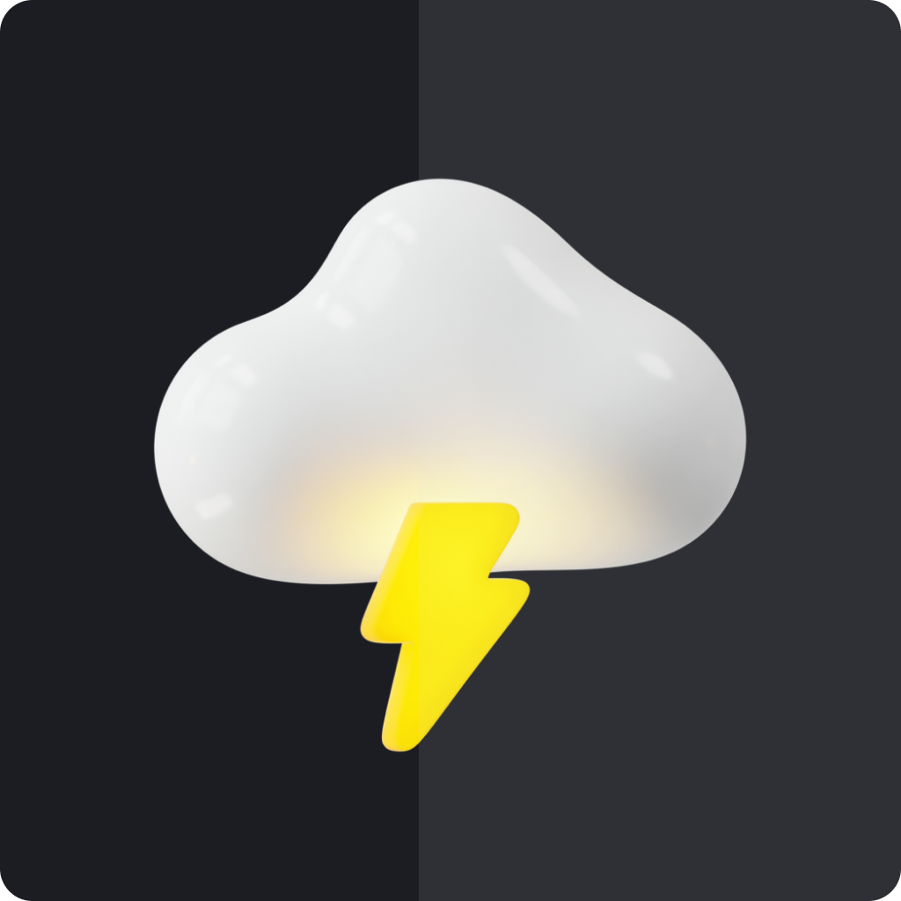

<div align='center'>
<h1 align="center">Find Weather</h1>


<p>Esse projeto foi desenvolvido para completar o desafio #7DaysOfCode desenvolvido pela Ilda Neta em parceria com a Alura, que na verdade não durou só 7 dias. Foram vários dias, estudando e lendo documentações para conseguir chegar ao fim.</p>

</div>

# 🤳Preview
https://user-images.githubusercontent.com/41305527/229100950-7ee0921a-e479-4fc9-ad5e-921a6c7ee5db.mp4

# 🔖 Como iniciar o projeto

### Clonando o projeto

```
git clone https://github.com/vladimiremi/find-weather.git
cd find-weather
npm install
```

### Startando o projeto

```
npx expo start
```

Você vai precisar adicioanar o arquivo .env para pode adicionar as suas KEY:
```
KEY_WEATHERAPI=

KEY_OPENWEATHERMAP=

KEY_OPENCAGEDATA=
```

# 🤔 Como Contribuir

- Fork este repositório;
- Crie uma branch com sua funcionalidade: `git checkout -b my-feature`;
- Commit suas auterações: `git commit -m 'feat: My new feature'`;
- Push para sua branch: `git push origin minha-feature`.

Depois que o merge do seu Pull request for feito, você pode deletar sua branch

# 📋Tarefas

### Tarefas do dia 1:

- [x] Criar um novo projeto utilizando o Expo
- [x] Adicionar o TypeScript
- [x] Organizar as pastas do projeto
- [x] Adicionar a fonte que vai usar
- [x] Criar uma conta no site das APIs que você utilizará no projeto

### Tarefas do dia 2:

- [x] Adicionar os estilos gerais
- [x] Instalar o styled-components
- [x] Criar os primeiros componentes do app (os que são utilizados na tela de boas vindas)
- [x] Criar a tela de boas vindas

### Tarefas do dia 3:

- [x] Instalar os pacotes das navegações Stack e Bottom Tabs utilizando o [React Navigation](https://caelum57945.lt.acemlnb.com/Prod/link-tracker?redirectUrl=aHR0cHMlM0ElMkYlMkZyZWFjdG5hdmlnYXRpb24ub3JnJTJGJTNGdXRtX3NvdXJjZSUzREFjdGl2ZUNhbXBhaWduJTI2dXRtX21lZGl1bSUzRGVtYWlsJTI2dXRtX2NvbnRlbnQlM0QlMjUyMzdEYXlzT2ZDb2RlJTJCLSUyQlJlYWN0JTJCTmF0aXZlJTJCY29tJTJCRXhwbyUyQjMlMjUyRjclMjUzQSUyQkNyaWFuZG8lMkJhJTJCdGVsYSUyQkhvbWUlMkJlJTJCaW5zdGFsYW5kbyUyQmElMkJuYXZlZ2ElMjVDMyUyNUE3JTI1QzMlMjVBM28lMjZ1dG1fY2FtcGFpZ24lM0QlMjU1QkFsdXJhJTJCJTI1MjM3RGF5cyUyQk9mJTJCQ29kZSUyNTVEJTI1MjhQeXRob24lMkJQYW5kYXMlMkItJTJCMSUyNUMyJTI1QUElMkJFZCUyQiUyNTI5JTJCMyUyNTJGNw==&sig=3sXUH8VHaXjhj7SsJpCnPPSFGdzcEtPB8VgxqJtovzbr&iat=1676718264&a=%7C%7C476258007%7C%7C&account=caelum57945%2Eactivehosted%2Ecom&email=%2FugXgXT6KHXc97giiD38qKyPUFd7JHyq9acdSgULWaM%3D&s=87881b8555547f90596aff8c0ccca863&i=2346A14404A266A16488)
- [x] Configurar a navegação do tipo Stack
- [x] Criar a tela Home com a variação para quando for o primeiro acesso do usuário (Empty State) e para quando o mesmo já possuir uma cidade selecionada

### Tarefas do dia 4:

- [x] Criar a tela Search
- [x] Criar os componentes da tela Search
- [x] Instalar e configurar o Axios
- [x] Consumir a API do Weather API
- [x] Salvar a consulta localmente
- [x] Criar a navegação do botão de voltar
- [x] Instalar e configurar biblioteca babel-plugin-inline-dotenv


### Tarefas do dia 5:
- [x] Instalar o Async Storage
- [x] Salvar a consulta da cidade ou país no Storage
- [x] Remover os dados fictícios da Home e consumir os dados da API
- [x] Verificar se o usuário já passou pela tela “Boas vindas” uma vez e, na próxima vez, exibir a tela Home diretamente
- [x] Formatar a data para o padrão brasileiro 

### Tarefas do dia 6: 
- [x] Utilizar os ícones de acordo com cada descrição da temperatura que você receberá das APIs WeatherApi e OpenWeather
- [x] Utilizar a API OpenWeather para visualizar o clima dos próximos 5 dias da cidade selecionada
- [x] Utilizar a API OpenCageData para receber o código do país da cidade selecionada e usar o resultado para a chamada da API que receberá o clima dos próximos 5 dias em uma certa cidade
- [x] Configurar as rotas BottomTabs

### Tarefas do dia 7: 
- [x] Criar Splash Screen
- [x] Inserir o ícone do app


### Tarefas extras: 
- [ ] Favoritar buscas
- [ ] Inserir animações
- [ ] Criar login social
- [ ] Adicionar testes unitários
